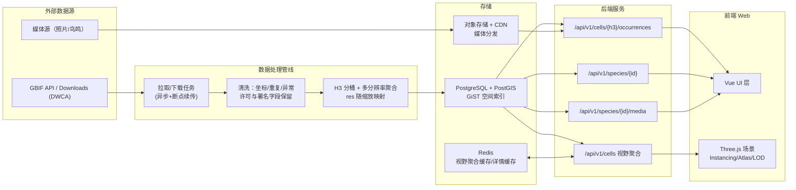

# 万羽拾音 Global Bird Symphony 技术架构与开发流程拆分

## Executive Summary

“万羽拾音（Global Bird Symphony）”是一类典型的**数据密集型 3D 交互可视化**项目：可落地，但必须把“海量点位 + 实时交互 + 浏览器性能”当作一等公民。工程成功的关键在于三条主线同时成立：  
一是**数据层先聚合再渲染**（按缩放级别动态聚合/拆分，避免把全量 occurrence 直接推到前端）；二是**渲染层批处理**（InstancedMesh + BufferGeometry 自定义属性 + 纹理图集，避免 draw call 与贴图切换爆炸）；三是**交互层可扩展拾取**（Raycaster 结合候选集筛选或 BVH 加速，避免 mousemove O(N)）。Three.js 明确指出 InstancedMesh 的目标就是降低 draw calls 提升性能。citeturn0search11turn10search1  
空间聚合建议以 H3 为“缩放分辨率”的骨架：H3 提供全球分层六边形网格（并包含必须的 pentagon），其分辨率统计表可用于把“相机距离/缩放”映射为合适的聚合粒度，但也应注意 H3 cell 面积会随地理位置变化而非完全恒定。citeturn8search16turn8search0  
数据来源以 GBIF 为主需要严格合规：GBIF 的下载 API 为异步任务且需要注册与认证；其 Darwin Core Archive 下载格式可包含 `occurrence.txt` 与 `multimedia.txt` 等文件；同时 Data User Agreement 要求保留所有权标识并对数据发布者进行公开致谢/引用（常通过 DOI）。citeturn0search1turn9search8turn9search3turn0search0  
V1 明确冻结为“主链路闭环”而非“全功能上线”：首版只交付 3D 地球、H3 聚合、cell 明细、物种详情、图片媒体与合规展示，AI 与音频仅保留后续扩展位置，不进入 V1 排期。媒体分发采用“合法镜像优先、来源链接兜底”的策略：只有在来源许可、使用条款与产品目标明确允许时才转存到自有 OSS/CDN，否则仅保留 metadata 与 source link。citeturn1search3turn1search19turn2search2turn11search0  

附注：  
- Three.js InstancedMesh 文档：https://threejs.org/docs/#api/en/objects/InstancedMesh  
- Three.js BufferGeometry 文档：https://threejs.org/docs/#api/en/core/BufferGeometry  
- H3 概览（Uber 博客）：https://www.uber.com/blog/h3/  
- H3 分辨率统计表（面积/边长、面积随位置变化说明）：https://h3geo.org/docs/core-library/restable/  
- GBIF 下载格式（DWCA, occurrence.txt, multimedia.txt）：https://techdocs.gbif.org/en/data-use/download-formats  
- GBIF 下载 API（异步/认证）：https://techdocs.gbif.org/en/data-use/api-downloads  
- GBIF Data User Agreement：https://www.gbif.org/terms/data-user  
- GBIF Citation Guidelines：https://www.gbif.org/citation-guidelines  
- OpenAI Responses API：https://developers.openai.com/api/reference/responses/overview/  
- OpenAI Rate limits：https://developers.openai.com/api/docs/guides/rate-limits/  
- OpenAI Data controls (“Your data”)：https://developers.openai.com/api/docs/guides/your-data/  
- MDN Web Audio API（中文）：https://developer.mozilla.org/zh-CN/docs/Web/API/Web_Audio_API  
- xeno-canto Terms of Use：https://xeno-canto.org/about/terms  

## 目标范围与工程假设

**目标平台**：Web 浏览器（桌面优先），移动端作为后续优化目标。  
**默认团队规模**：2–4 人（前端/3D 1–2，后端/数据 1，产品/设计与运维可兼职）。  
**预算与上线策略**：以“可演示闭环”为第一阶段目标；性能与数据规模按里程碑递进，不追求一次到位。  
**非目标（建议明确写入 PRD）**：  
- 不做“实时全球全量点位”展示（GBIF occurrence 规模极大，且公共 API 不应被当作实时流使用）。  
- 不承诺移动端 60FPS（移动端需单独性能预算，且涉及触控交互与内存约束）。  

**核心工程原则**：  
- 所有阶段都必须具备：可运行演示、可回滚部署、最小可观测（日志/指标/错误采集）。  
- 前端只消费“当前视野 + 当前 LOD”的数据；后端只提供“聚合优先、明细按需”的接口形态。  
- 合规字段永不丢失：数据来源 key、license、attribution、DOI 等贯穿管线（GBIF 协议明确要求保留所有权标识并进行公开致谢/引用）。citeturn9search3turn0search0  

**V1 冻结范围（建议写入 PRD 与联调契约）**：  
- 只以 `/api/v1` REST 契约为准，不再以 `/api/...` 或未版本化路径作为正式接口。  
- 只交付 `/api/v1/cells`、`/api/v1/cells/{h3}/occurrences`、`/api/v1/species/{speciesKey}`、`/api/v1/species/{speciesKey}/media`、`/api/v1/compliance/downloads/{downloadKey}`；`/api/v1/media/{mediaId}/signed-url` 仅在鉴权和合法镜像策略明确后启用。  
- 媒体范围仅限图片（StillImage）；音频、视频、AI、GraphQL 均不进入 V1 开发与验收。  
- 媒体转存只允许基于 allowlist 的来源/许可策略执行；不满足镜像条件的资源只展示来源链接与归属信息。  

附注：  
- GBIF Terms & Agreements：https://www.gbif.org/terms  
- GBIF Data User Agreement（保留所有权标识/公开致谢）：https://www.gbif.org/terms/data-user  
- GBIF Citation Guidelines（DOI 引用）：https://www.gbif.org/citation-guidelines  
- GBIF 技术文档（API Reference）：https://techdocs.gbif.org/en/openapi/  

## 总体技术架构与数据流

### 架构分层

**前端（Web）**  
- UI：Vue 3 + Vite + TypeScript（中文生态成熟，工程效率高）。citeturn3search0turn3search1  
- 3D：Three.js（自建 globe 场景，便于 Instancing、shader、拾取与性能管控）。citeturn0search11turn10search1  

**后端（API）**  
- 聚合/视野查询服务：REST 优先（更直观、易缓存）；GraphQL 可作为“物种卡片组合查询”的补充（避免 N+1）。citeturn10search3  
- 缓存：Redis（热点视野聚合结果与物种详情）。Redis 官方文档强调 eviction policy 与 TTL 对内存上限场景的重要性。citeturn1search6turn1search2  

**数据层（存储/计算）**  
- 数据库：PostgreSQL + PostGIS（空间索引与空间谓词），并建立 GiST 索引且使用“空间索引可感知”的函数；PostGIS FAQ 明确指出使用空间索引需要“创建索引”和“使用索引感知函数”。citeturn1search17turn2search0  
- 空间网格：H3（多分辨率聚合骨架）。H3 在线文档提供各 resolution 的平均面积/平均边长统计表，并说明 cell 面积随位置变化。citeturn0search2turn8search0  
- 数据来源：GBIF Occurrence / Download（大规模用 Download API 的异步任务），下载格式可用 DWCA（含 `occurrence.txt`/`multimedia.txt`）。citeturn9search8turn0search1  

### 数据流示意（Mermaid）



### 关键选型对比（语言/框架）

| 维度 | 推荐方案 | 备选方案 | 选择理由（工程可执行角度） |
|---|---|---|---|
| 前端 UI | Vue 3 + TS | React + TS | Vue 官方中文文档完善，工程效率高；两者对 3D 性能影响不大。citeturn3search0 |
| 3D 引擎 | Three.js | CesiumJS / globe.gl | 需要深度控制 Instancing、shader、拾取与批处理时 Three.js 更可控；Sprite/BufferGeometry/InstancedMesh 文档齐全。citeturn0search11turn10search2turn10search1 |
| 后端 API | TypeScript（Node） | Go / Python | POC 到中等规模可用性强，且类型可与前端共享（协议/DTO）；生产级若 CPU 聚合/并发更高可演进到 Go。 |
| 空间聚合 | H3 | geohash / S2 | H3 具备层级分辨率、统计表与成熟生态；但要处理“面积随位置变化”的视觉差异。citeturn8search0 |
| 空间存储与查询 | PostGIS | ClickHouse+geo / Elastic geo | PostGIS 空间索引与空间谓词成熟且有明确索引使用指导。citeturn1search17turn2search0 |
| AI | OpenAI Responses + 工具调用 | 兼容 OpenAI 的第三方模型 | OpenAI 提供 Responses、function calling、rate limits、data controls 的官方规范，便于合规与治理。citeturn1search11turn8search1turn1search3turn1search19 |

附注：  
- Vue 官方中文文档：https://cn.vuejs.org/  
- Vite 官方中文文档：https://cn.vite.dev/guide/  
- Three.js 官方文档（InstancedMesh/Sprite/BufferGeometry/Raycaster）：https://threejs.org/docs/  
- H3 文档（restable, indexing）：https://h3geo.org/docs/  
- GBIF 技术文档（API/Downloads/Formats）：https://techdocs.gbif.org/  
- PostGIS 空间索引 FAQ：https://postgis.net/documentation/faq/spatial-indexes/  
- PostGIS ST_Intersects（中文）：https://postgis.net/docs/manual-3.7/zh_Hans/ST_Intersects.html  

## 分阶段开发计划与里程碑验收

> 阶段名可沿用 V1/V2/V3，但为避免“范围膨胀”，建议加入 V1.5 / V2.5 这类“工程化关口”。

### 里程碑总表

| 阶段 | 建议周期（小团队） | 优先级 | 阶段目标（结果导向） | 关键交付物 | 验收标准（可操作/可测） |
|---|---:|---:|---|---|---|
| V1 主链路闭环 | 5–6 周 | P0 | 地球交互、聚合查询、明细卡片、物种详情、图片媒体与合规页全部可联调 | `/api/v1` 正式契约；小样本 ETL；前后端联调；staging 部署 | 桌面浏览器稳定运行；主链路可演示；关键错误可定位；图片媒体只在 allowlist 条件下镜像 |
| V2 性能与数据规模 | 3–4 周 | P0 | 万级/十万级“看得顺、点得准” | InstancedMesh + 纹理图集；LOD 与 H3 聚合优化；Redis 缓存；PostGIS 空间索引 | marker draw calls 控制在个位数；聚合 API P95 明显下降；视野切换稳定citeturn0search11turn1search0 |
| V3 音频媒体扩展 | 2–3 周 | P1 | 在许可和来源链路明确前提下接入音频播放 | 音频媒体模型、播放控件、CORS/Range 验证 | 音频仅来自允许来源；播放链路与归属展示完整citeturn11search0 |
| V4 AI 与产品化 | 3–5 周 | P1 | AI 导览与解释完成闭环 | AI 代理（鉴权/限流/审计/成本）；function calling；数据引用 UI | AI 不直连模型密钥；触发 rate limit 有退避策略；数据控制策略明确citeturn1search3turn1search19turn8search1 |
| V5 生产级运维扩展 | 持续 | P2 | 多实例高可用、可演练、可扩容 | 灰度/回滚；多区缓存策略；告警与容量规划 | 单实例故障不影响服务；告警覆盖关键 SLO；成本与容量可预测 |

### V1 排期与工作规划（按 2026-04-06 启动）

| 周次 | 日期 | 工作重点 | 责任划分 | 周验收门槛 |
|---|---|---|---|---|
| 第 1 周 | 2026-04-06 ~ 2026-04-10 | 冻结 PRD 范围、冻结 `/api/v1` 契约、建前后端仓库骨架与 CI | 前端/后端共同确认 DTO；后端建健康检查与 schema；前端起 Globe 骨架 | 契约评审通过；本地可一键启动；CI 首次通过 |
| 第 2 周 | 2026-04-13 ~ 2026-04-17 | 打通 GBIF 下载、DWCA 解压、occurrence staging 导入；前端完成相机控制与基础场景 | 后端完成 download/parse/import；前端完成相机、底图、调试面板 | 给定 predicate 能导入样本；前端可稳定旋转缩放 |
| 第 3 周 | 2026-04-20 ~ 2026-04-24 | 完成 H3 聚合与 `/api/v1/cells`；前端接入聚合渲染与节流/取消 | 后端交付 `/cells`；前端完成 Instancing 渲染、LOD、请求取消 | 视野变化可刷新；`/cells` 稳定返回；≥2k marker 可交互 |
| 第 4 周 | 2026-04-27 ~ 2026-05-01 | 完成 `/occurrences`、`/species`；前端完成卡片、分页与错误态 | 后端交付分页与物种详情；前端完成 cell 点击、物种详情抽屉 | 主链路从 Globe 到详情页跑通；400/404/429/503 处理可演示 |
| 第 5 周 | 2026-05-04 ~ 2026-05-08 | 完成图片媒体、归属展示、合规页；按 allowlist 实现镜像或来源链接兜底 | 后端交付 `/media` 与 `/compliance`；前端完成图片列表与 attribution UI | 图片媒体可浏览；license/rightsHolder/publisher 可展示；不满足镜像条件时自动降级为来源链接 |
| 第 6 周 | 2026-05-11 ~ 2026-05-15 | staging 联调、缓存/限流、部署与 go/no-go 评审 | 后端完成 Redis、限流、部署；前端完成回归与性能巡检 | staging 可演示；request id 可定位问题；形成上线清单与已知问题列表 |

附注：  
- Three.js InstancedMesh（降低 draw calls，提高渲染性能）：https://threejs.org/docs/#api/en/objects/InstancedMesh  
- MDN WebGL Best practices（texture atlasing 合并批次）：https://developer.mozilla.org/en-US/docs/Web/API/WebGL_API/WebGL_best_practices  
- H3 统计表与面积变化说明：https://h3geo.org/docs/core-library/restable/  
- GBIF 下载 API（异步/认证）：https://techdocs.gbif.org/en/data-use/api-downloads  
- OpenAI Rate limits：https://developers.openai.com/api/docs/guides/rate-limits/  
- OpenAI Data controls：https://developers.openai.com/api/docs/guides/your-data/  
- xeno-canto Terms：https://xeno-canto.org/about/terms  

## 模块级方案清单

> 本节按模块给出：功能说明、推荐技术/库（按适配性→性能→生态成熟度→效率排序）、关键实现要点、常见坑与解决方案、学习资源（链接统一在本节“附注”）。

### 前端可视层（UI/状态管理/叠加层）

**功能说明**：搜索、筛选、信息卡片、设置面板；承载与 3D 场景的状态同步。AI 对话不进入 V1。  
**推荐技术/库**：Vue 3 + Vite + TypeScript（首选）。citeturn3search0turn3search1  
**关键实现要点**：  
- “UI 与 3D 分层”：DOM 做 UI，Canvas 做 3D；用统一状态（selected cell/species、camera pose、filters）驱动两层。  
- 相机状态可序列化（便于分享链接/回放/埋点）。  
**常见坑与解决方案**：  
- UI 动画抢主线程：限制同时动画数量；把 marker hover 动效尽量放到 shader/instance 属性更新而非 DOM reflow。  
**学习资源**：Vue/Vite 官方中文文档（见附注）。

### 3D 渲染核心（地球/marker/网格/渲染循环）

**功能说明**：渲染地球球体、经纬网格、聚合/明细 marker、基础光效；管理帧循环与资源生命周期。  
**推荐技术/库**：Three.js（首选）。  
- InstancedMesh：大量同几何/材质对象实例化，降低 draw calls。citeturn0search11  
- BufferGeometry：缓冲区存储顶点与自定义属性，降低 CPU→GPU 传输成本。citeturn10search1  
**关键实现要点**：  
- marker 不允许“一鸟一 Mesh”：统一几何（quad）+ instancing；每个实例仅携带变换矩阵与少量属性（size、uvOffset、color、id）。  
- 纹理图集（atlas）是批处理核心：MDN 指出切换纹理会拆分 draw call 批次，texture atlasing 可合并更多绘制到更少批次。citeturn1search0  
**常见坑与解决方案**：  
- 透明材质 overdraw：尽量减少透明叠层；采用 alphaTest 或分层渲染策略（必要时）。  
- 图集“渗色/串图”：为子图留 padding，考虑 mipmap 与采样方式（WebGL best practices 有相关说明）。citeturn1search0  

### 着色器与广告牌（Billboarding/强调效果）

**功能说明**：让 marker 始终正对相机（广告牌），实现 hover 高亮、聚合强度着色、球体氛围光晕。  
**推荐技术/库**：  
- V1/V2 快速方案：Three.js Sprite（天然朝向相机）。Sprite 文档明确说明其“总是面向相机”。citeturn10search2  
- V2/V3 强化方案：自定义 shader（ShaderMaterial / onBeforeCompile）+ InstancedMesh 自定义 attribute。  
**关键实现要点**：  
- Sprite 适合快速验证交互与视觉；但当数量极大、需要图集与自定义属性时，InstancedMesh + 自定义 shader 更可控。  
**常见坑与解决方案**：  
- GPU 上每帧更新大量 instance 属性：尽量批量写入 TypedArray，并减少频繁重新分配。  
**学习资源**：Three.js Sprite/InstancedMesh/BufferGeometry 文档（见附注）。

### 交互与拾取（Hover/Click/对焦/卡片）

**功能说明**：鼠标悬停提示、点击对焦旋转、选中状态、卡片弹出与关闭。  
**推荐技术/库**：  
- Three.js Raycaster（基础拾取）。Raycaster 文档包含对 sprites 等“视图相关对象”的 camera 字段说明。citeturn0search7  
- three-mesh-bvh：对复杂 mesh 的 raycasting 加速与空间查询（适合高面数地球/边界网格等）。该库说明其目标是加速 raycasting 与空间查询。citeturn7search3  
**关键实现要点**：  
- 两级拾取：先用屏幕空间格网/空间哈希缩小候选集，再做精确判定（Raycaster 或屏幕距离阈值）。  
- 对焦动画：相机参数插值（避免逐帧创建对象），支持取消/打断（用户继续拖动）。  
**常见坑与解决方案**：  
- mousemove 触发过频：节流（16–33ms）+ 候选集筛选；避免每次对全部实例 raycast。  
- 若对复杂 mesh（非实例）拾取：用 BVH 加速或简化碰撞体。citeturn7search3turn7search11  

### 空间索引与映射层（H3/坐标转换/LOD）

**功能说明**：把经纬度映射到球面坐标；按缩放动态决定聚合分辨率；输出适配渲染的数据结构。  
**推荐技术/库**：  
- H3：lat/lng → cell（分桶），并提供分辨率统计表（平均面积/边长；同时说明面积随位置变化）。citeturn7search10turn8search0  
- h3-js：提供 `latLngToCell(lat,lng,res)` 等 API。citeturn7search6  
**关键实现要点**：  
- LOD 决策必须有“滞回”：避免缩放临界点抖动频繁切 res。  
- 面积不恒定：可改用“屏幕像素尺寸目标”而非“固定 km²”来决定 res（以体验为先）。citeturn8search0  
**常见坑与解决方案**：  
- 直接用 H3 cell 边界画六边形：视觉上在高纬会产生差异，且会提高渲染负担；建议优先点/热度展示，把六边形作为调试可视化。  
**学习资源**：H3 文档（restable、indexing、latLngToCell 说明）、h3-js README（见附注）。

### 后端 API（视野聚合/明细/百科/媒体）

**功能说明**：  
- `/api/v1/cells`：按视野 bbox + 分辨率返回聚合 cell（数量可控，可缓存）。  
- `/api/v1/cells/{h3}/occurrences`：返回该 cell 的明细分页。  
- `/api/v1/species/{id}`：百科详情（可缓存）。  
- `/api/v1/species/{id}/media`：图片媒体列表与归属字段。  
- `/api/v1/compliance/downloads/{downloadKey}`：下载级别的 citation/rights 汇总。  
**推荐技术/库**：REST 优先；GraphQL 作为补充（schema 需规范化）。GraphQL 官方文档描述 schema/type 的契约意义与文档能力。citeturn10search3turn10search19  
**关键实现要点**：  
- API 返回结构面向渲染：positions/uvOffset/scale/id 的数组形式，避免返回过度嵌套 JSON。  
- 缓存友好：对聚合接口设置 ETag/Cache-Control，Redis 做 server-side cache。  
**常见坑与解决方案**：  
- 把明细当默认：会导致网络与渲染雪崩；必须强制分页与 LOD。  
- GraphQL N+1：需要 DataLoader 或服务端聚合字段。  

### 数据存储（PostGIS 空间索引/分区/查询模式）

**功能说明**：存储 occurrence 点位（抽样/有限明细）、H3 聚合表、多媒体元数据与许可链路。  
**推荐技术/库**：PostgreSQL + PostGIS。  
- PostGIS FAQ 强调空间索引对性能“极其重要”，并要求“创建 GiST 索引 + 使用索引感知函数”。citeturn1search17  
- `ST_Intersects` 中文手册明确其会自动包含 bbox 比较以利用空间索引。citeturn2search0  
- `ST_MakePoint` 文档注明对地理坐标 X=经度、Y=纬度。citeturn7search1  
- PostGIS Data Management 说明 geography 默认 SRID 为 4326（WGS84）且计算基于 WGS84。citeturn8search3  
**关键实现要点**：  
- occurrence 明细表：将 `geog geography(Point,4326)` 与 `h3_r{n}`（B-tree）并存；前者用于 bbox 精确过滤，后者用于聚合与 join。  
- 大表治理：PostgreSQL 原生声明式分区可用于把大表拆小、降低维护成本。citeturn7search0  
**常见坑与解决方案**：  
- 空间索引不生效：检查是否真的在空间列上建 GiST，且查询使用 `ST_Intersects` 等索引感知函数。citeturn1search17turn2search0  

### 数据清洗与同步（GBIF 拉取/解析/聚合）

**功能说明**：从 GBIF 获取 occurrence/物种信息，清洗并落库，生成多分辨率 H3 聚合结果。  
**推荐技术/库**：  
- GBIF Download API（大批量、异步、需认证）。citeturn9search8turn0search13  
- DWCA 下载格式（`occurrence.txt`、`multimedia.txt` 等）。citeturn0search1  
- GBIF API Reference / Species API（补全物种信息）。citeturn9search0turn9search1  
**关键实现要点**：  
- 避免分页爬全量：大规模数据用 Download API；并遵循 GBIF 平台负载与建议实践（技术社区与工具文档普遍建议用 download 做 bulk）。citeturn9search12turn0search13  
- 合规字段贯穿：datasetKey/license/attribution/DOI 信息必须保留（Data User Agreement 要求保留所有权标识并公开致谢）。citeturn9search3turn0search0  
**常见坑与解决方案**：  
- 期望每条 occurrence 都有媒体：并非总是如此；需要单独媒体源或只在有 `multimedia.txt`/可用 license 时展示。citeturn0search1  

### 缓存（Redis）

**功能说明**：缓存视野聚合结果、热点 cell 明细与物种百科，降低 DB 压力与 P95 延迟。  
**推荐技术/库**：Redis。Redis 文档说明 eviction policy 决定内存到上限后的驱逐行为，且建议合理使用 TTL。citeturn1search2turn1search6  
**关键实现要点**：  
- key 设计：`cells:{res}:{bboxHash}:{filtersHash}`、`cell:{res}:{h3}`、`species:{id}`。  
- TTL 分层：聚合短（秒级到分钟级）、百科长（小时级到天级）。  
**常见坑与解决方案**：  
- 无 TTL 导致不可控内存：对可缓存内容强制 TTL，并选择合适的 maxmemory-policy。citeturn1search6turn1search2  

### AI 集成（代理/工具调用/合规与成本）

**功能说明**：点击物种后提供解释与导览；对“分布为何如此”“该区域 top species”等问题，优先基于系统数据回答。  
**推荐技术/库**：  
- OpenAI Responses API（官方称其为最先进的生成接口，支持工具与函数调用）。citeturn1search11turn8search5  
- Function calling 指南（连接外部系统与数据）。citeturn8search1  
- Rate limits 指南（限流与退避）。citeturn1search3turn1search15  
- Data controls（API 数据默认不用于训练，除非显式 opt-in）。citeturn1search19  
**关键实现要点**：  
- **服务端代理**：密钥永不下发前端；统一做鉴权、限流、审计、缓存、降级（“无 AI/降级回答”必须可用）。  
- **工具调用优先**：把“查询 cell 聚合/查询物种百科/查询媒体许可”做成函数工具，减少幻觉。citeturn8search1  
**常见坑与解决方案**：  
- 成本失控：按用户/会话预算、对重复问法做缓存、对长对话做摘要与截断。  
- 合规遗漏：记录每次调用的目的与数据来源；对外展示“数据来源与时间”。citeturn1search19  

### 音频处理（鸟鸣播放/预加载/许可）

**功能说明**：播放鸣叫、调节音量/声像、避免自动播放限制，必要时做简单可视化。  
**推荐技术/库**：Web Audio API（MDN 中文文档说明其适用于选择音频源、添加效果、可视化与空间效果，并标注跨浏览器可用性）。citeturn2search2turn2search14  
**关键实现要点**：  
- 初始化 AudioContext 必须绑定用户手势（避免浏览器自动播放策略触发失败）。citeturn2search14  
- 媒体许可严格建模：xeno-canto 声音以多种 Creative Commons 许可发布并要求遵守条款。citeturn11search0  
- 若使用 Macaulay Library：其支持“研究与部分教育用途”，商业用途往往需要许可协议，并提供署名指南。citeturn11search14turn11search15  
**常见坑与解决方案**：  
- CORS/Range：确保媒体分发支持跨域与范围请求（利于流式/断点）。  
- 版权链路断裂：asset 表强制 `license` 与 `attribution` 非空。  

### 测试（单测/集成/E2E/性能回归）

**功能说明**：验证数学与空间算法、API 合同、主要交互链路、性能预算守护。  
**推荐技术/库**：  
- Vitest（中文站点说明其与 Vite 深度集成且速度快）。citeturn3search2turn3search10  
- Playwright（中文站点说明支持 Chromium/WebKit/Firefox 且具备自动等待降低碎片测试）。citeturn3search3turn3search7  
**关键实现要点**：  
- 把经纬度→3D、H3 分桶、LOD 决策等写成纯函数，便于单测。  
- E2E 断言以“可观测状态”（camera pose、selected id、接口返回）为主，避免像素级脆弱断言。  
**常见坑与解决方案**：  
- WebGL 测试不稳定：在场景 ready 后再交互；必要时对关键状态打点（window.__APP_STATE__）。  

### CI/CD（构建/镜像/部署）

**功能说明**：自动化执行 lint/test/build、构建 Docker 镜像、部署到测试/生产环境。  
**推荐技术/库**：  
- GitHub Actions（官方文档说明其可在仓库内自动化 CI/CD 工作流）。citeturn4search3turn4search7  
- Docker 官方 workshop（提供容器化应用的步骤指引）。citeturn4search0turn4search12  
**关键实现要点**：  
- 最小流水线：PR → lint+test+build；main → build docker image + push + deploy。  
**常见坑与解决方案**：  
- 镜像体积过大：多阶段构建；前端静态资源与后端服务分镜像/分部署单元。  

### 监控与运维（指标/日志/追踪/告警）

**功能说明**：观测 API 延迟、错误率、缓存命中率、DB/Redis 资源；支持故障定位与容量规划。  
**推荐技术/库**：  
- OpenTelemetry：文档定义其为中立的可观测框架，覆盖 traces/metrics/logs。citeturn5search2turn5search16  
- Prometheus：官方 getting started 描述安装、抓取与查询流程。citeturn5search0  
- Grafana：文档说明 dashboard 由多个 panel 组成用于概览并可视化数据。citeturn5search1turn5search5  
**关键实现要点**：  
- SLO 核心接口：`GET /cells`（聚合）与 `GET /cells/{h3}`（明细）的 P95 延迟与错误率必须有指标与告警。  
**常见坑与解决方案**：  
- 只有日志没有链路：强制 request id，结合 tracing 把 Redis/DB 调用串起来（OTel）。citeturn5search2  

### 安全与隐私（API 安全/前端安全/数据合规）

**功能说明**：鉴权/限流、防滥用、敏感信息保护、第三方数据许可与引用合规。  
**推荐技术/规范**：  
- OWASP API Security Top 10（中文项目与 PDF）。citeturn5search7turn5search3  
- CSP：MDN 中文说明 CSP 是额外安全层，缓解 XSS 与注入攻击。citeturn2search3  
- OpenAI Data controls：明确 API 数据默认不用于训练（除非显式选择）。citeturn1search19  
**关键实现要点**：  
- API 关键路径都要有：鉴权、限流、配额、审计日志。  
- 前端默认开启 CSP，尽量避免不必要的第三方脚本。citeturn2search3  
- GBIF 合规：保留记录所有权标识、公开致谢/引用（DOI）。citeturn9search3turn0search0  

附注：  
- Vue 官方中文文档：https://cn.vuejs.org/  
- Vite 官方中文文档：https://cn.vite.dev/guide/  
- Vitest 中文文档：https://cn.vitest.dev/  
- Playwright 中文网：https://playwright.nodejs.cn/  
- Three.js InstancedMesh：https://threejs.org/docs/#api/en/objects/InstancedMesh  
- Three.js BufferGeometry：https://threejs.org/docs/#api/en/core/BufferGeometry  
- Three.js Sprite（always faces camera）：https://threejs.org/docs/#api/en/objects/Sprite  
- Three.js Raycaster：https://threejs.org/docs/#api/en/core/Raycaster  
- three-mesh-bvh（加速 raycasting）：https://github.com/gkjohnson/three-mesh-bvh  
- MDN WebGL Best practices：https://developer.mozilla.org/en-US/docs/Web/API/WebGL_API/WebGL_best_practices  
- H3 restable（统计表与面积变化）：https://h3geo.org/docs/core-library/restable/  
- H3 indexing API（latLngToCell）：https://h3geo.org/docs/api/indexing/  
- h3-js README（latLngToCell）：https://github.com/uber/h3-js/blob/master/README.md  
- GBIF API Reference：https://techdocs.gbif.org/en/openapi/  
- GBIF Species API：https://techdocs.gbif.org/en/openapi/v1/species  
- GBIF Downloads API：https://techdocs.gbif.org/en/data-use/api-downloads  
- GBIF Download formats（DWCA）：https://techdocs.gbif.org/en/data-use/download-formats  
- GBIF Data User Agreement：https://www.gbif.org/terms/data-user  
- GBIF Citation Guidelines：https://www.gbif.org/citation-guidelines  
- PostGIS 空间索引 FAQ：https://postgis.net/documentation/faq/spatial-indexes/  
- PostGIS ST_Intersects（中文）：https://postgis.net/docs/manual-3.7/zh_Hans/ST_Intersects.html  
- PostGIS ST_MakePoint：https://postgis.net/docs/ST_MakePoint.html  
- PostgreSQL 分区（官方）：https://www.postgresql.org/docs/current/ddl-partitioning.html  
- Redis key eviction：https://redis.io/docs/latest/develop/reference/eviction/  
- Redis eviction policy：https://redis.io/docs/latest/operate/rs/databases/memory-performance/eviction-policy/  
- OpenAI Responses API：https://developers.openai.com/api/reference/responses/overview/  
- OpenAI Function calling：https://developers.openai.com/api/docs/guides/function-calling/  
- OpenAI Rate limits：https://developers.openai.com/api/docs/guides/rate-limits/  
- OpenAI Your data：https://developers.openai.com/api/docs/guides/your-data/  
- MDN Web Audio API（中文）：https://developer.mozilla.org/zh-CN/docs/Web/API/Web_Audio_API  
- xeno-canto Terms：https://xeno-canto.org/about/terms  
- Macaulay Library 使用与请求媒体：https://support.ebird.org/en/support/solutions/articles/48001064551-using-and-requesting-media  
- Macaulay Library 署名指南：https://support.ebird.org/en/support/solutions/articles/48001064570-crediting-media  
- OWASP API 安全 Top 10 中文项目：https://www.owasp.org.cn/OWASP-CHINA/owasp-project/owasp-api-security-top-104e2d6587987976ee/  

## 接口设计与数据库模型

### REST 接口示例（V1 正式主路径）

**视野聚合（核心接口）**  
- 目标：返回“当前视野 + 当前 H3 res”的 cell 列表，数量可控、便于缓存。  
- 参数：`h3Res`、`bbox`（minLon,minLat,maxLon,maxLat）、`filters`（可选：季节/时间段/物种组/数据集）。

```http
GET /api/v1/cells?h3Res=7&bbox=100.0,0.0,120.0,15.0&filters=season:all
```

响应（适配 Instanced 渲染）建议包含：cell 中心点、count、speciesCount、topSpecies（TopK）、可选的渲染 hint（atlas id / marker 基准大小）。

**cell 明细**  
```http
GET /api/v1/cells/{h3}/occurrences?limit=200&cursor=gbif_id:123456789
```

**物种百科**  
```http
GET /api/v1/species/{speciesKey}
```

**媒体**  
```http
GET /api/v1/species/{speciesKey}/media?type=StillImage&limit=20
```

**合规与引用**  
```http
GET /api/v1/compliance/downloads/{downloadKey}
```

> V1 不提供 `/api/cells/{h3}/species`、音频媒体端点与 AI 代理端点；这些能力进入后续阶段时再单独补充契约。  

### GraphQL 示例（作为补充）

GraphQL schema/type 的契约与文档能力见官方 “Schemas and Types”。citeturn10search3turn10search19  

```graphql
type Query {
  cells(h3Res: Int!, bbox: BBoxInput!, filters: FiltersInput): CellAggPage!
  species(speciesKey: ID!): Species
}

input BBoxInput { minLon: Float!, minLat: Float!, maxLon: Float!, maxLat: Float! }

type CellAggPage {
  h3Res: Int!
  generatedAt: String!
  cells: [CellAgg!]!
}

type CellAgg {
  h3: ID!
  centerLat: Float!
  centerLon: Float!
  count: Int!
  speciesCount: Int!
  topSpecies: [SpeciesCount!]!
}

type SpeciesCount {
  speciesKey: ID!
  scientificName: String!
  count: Int!
}

type Species {
  speciesKey: ID!
  scientificName: String!
  vernacularNameZh: String
  mediaImages(limit: Int = 10): [MediaAsset!]!
  mediaAudios(limit: Int = 5): [MediaAsset!]!
}

type MediaAsset {
  id: ID!
  type: String!
  url: String!
  license: String
  attribution: String
  source: String
}
```

### 数据库表与索引设计（示例）

> 核心依据：  
> - PostGIS FAQ：空间索引对性能很重要，需 GiST + 索引感知函数。citeturn1search17  
> - `ST_Intersects`：中文手册说明其会自动包含 bbox 比较以利用空间索引。citeturn2search0  
> - `ST_MakePoint`：对地理坐标 X=经度、Y=纬度。citeturn7search1  
> - geography SRID 默认 4326 且计算用 WGS84。citeturn8search3  

| 表 | 主键 | 核心字段 | 关键索引 | 备注 |
|---|---|---|---|---|
| `species` | `species_key` | 学名、中文名、分类等级、更新时间 | `btree(scientific_name)`（可选） | 物种百科表 |
| `occurrence` | `gbif_id` | `species_key`、`dataset_key`、`geog`、`h3_r{n}`、`license` | `gist(geog)`；`btree(h3_r7)`；`btree(species_key)` | 明细表建议抽样或分区 |
| `cell_agg` | (`h3_res`,`h3`) | center、count、species_count、top_species(jsonb)、updated_at | `btree(h3_res,h3)`；`btree(updated_at)` | 多分辨率聚合表 |
| `media_asset` | `asset_id` | `species_key`、type、url、license、attribution、source | `btree(species_key,type)` | 许可/署名强约束 |
| `dataset_ref` | `dataset_key` | publisher、license、doi 等 | `btree(license)` | 合规与引用页 |

示例 SQL（只展示要点，注意坐标轴）：  
- `ST_MakePoint` 的文档明确说明对地理坐标 X=lon、Y=lat。citeturn7search1  

```sql
-- 生成 geography 点（示例）
UPDATE occurrence
SET geog = ST_SetSRID(ST_MakePoint(lon, lat), 4326)::geography
WHERE geog IS NULL;
```

分区建议：当 occurrence 明细较大时，使用 PostgreSQL 声明式分区把大表拆分（例如按 dataset_key 哈希、按时间范围或按大区）。PostgreSQL 官方文档说明其支持声明式分区与分区键。citeturn7search0  

### 关键算法伪代码（按需求清单）

**经纬度 → 3D 坐标（球面半径 R）**

```text
function latLonToCartesian(latDeg, lonDeg, R):
  lat = radians(latDeg)
  lon = radians(lonDeg)
  x = R * cos(lat) * cos(lon)
  y = R * sin(lat)
  z = R * cos(lat) * sin(lon)
  return (x, y, z)
```

**H3 分桶（lat/lng → cell）**  
H3 与 h3-js 都将 “latLngToCell” 定义为把地理点分桶到指定分辨率的 H3 网格。citeturn7search10turn7search6  

```text
for each record(lat, lng, speciesKey):
  cell = H3.latLngToCell(lat, lng, res)
  agg[cell].count += 1
  agg[cell].speciesCounter[speciesKey] += 1
```

**LOD 决策（缩放/距离 → H3 res）**  
H3 提供分辨率统计表（平均面积/边长），并说明面积随位置变化，因此 LOD 建议引入滞回与以“屏幕像素尺寸”校准。citeturn8search0turn0search2  

```text
function chooseRes(cameraDistance):
  if cameraDistance > T1: return 5
  if cameraDistance > T2: return 6
  if cameraDistance > T3: return 7
  return 8

function chooseResWithHysteresis(prevRes, cameraDistance):
  res = chooseRes(cameraDistance)
  if res != prevRes and abs(cameraDistance - threshold(prevRes)) < margin:
    return prevRes
  return res
```

**InstancedMesh 渲染流程**  
InstancedMesh 的目的在于减少 draw calls 提升整体性能。citeturn0search11  

```text
setup:
  geometry = quad(2 triangles)
  material = shader(atlasTexture)
  mesh = InstancedMesh(geometry, material, N)

updateInstances(instances):
  for i in 0..N-1:
    mesh.setMatrixAt(i, instances[i].matrix)
    instanceUV[i] = (offsetU, offsetV, scaleU, scaleV)
  mesh.instanceMatrix.needsUpdate = true
```

**Raycaster 拾取优化（候选集筛选 + 精确判定）**  
Raycaster 用于拾取，且对 sprites 等视图相关对象需要 camera 信息。citeturn0search7turn10search2  

```text
onCameraOrDataChange:
  rebuildScreenGrid(instances)

onPointerMove(x,y):
  candidates = grid.neighbors(x,y)
  hovered = nearestByScreenDistance(candidates, x, y, thresholdPx)
  if hovered found:
    return hovered.instanceId
  else:
    return null
```

附注：  
- GraphQL Schema（官方）：https://graphql.org/learn/schema/  
- Three.js InstancedMesh：https://threejs.org/docs/#api/en/objects/InstancedMesh  
- Three.js Raycaster：https://threejs.org/docs/#api/en/core/Raycaster  
- Three.js Sprite：https://threejs.org/docs/#api/en/objects/Sprite  
- H3 Indexing（latLngToCell）：https://h3geo.org/docs/api/indexing/  
- h3-js README（latLngToCell）：https://github.com/uber/h3-js/blob/master/README.md  
- H3 分辨率统计（面积/边长、面积随位置变化）：https://h3geo.org/docs/core-library/restable/  
- PostGIS 空间索引 FAQ：https://postgis.net/documentation/faq/spatial-indexes/  
- PostGIS ST_Intersects（中文）：https://postgis.net/docs/manual-3.7/zh_Hans/ST_Intersects.html  
- PostGIS ST_MakePoint：https://postgis.net/docs/ST_MakePoint.html  
- PostGIS Data Management（geography SRID/WGS84）：https://postgis.net/docs/using_postgis_dbmanagement.html  
- PostgreSQL 分区（官方）：https://www.postgresql.org/docs/current/ddl-partitioning.html  
- OpenAI Rate limits：https://developers.openai.com/api/docs/guides/rate-limits/  
- OpenAI Your data：https://developers.openai.com/api/docs/guides/your-data/  

## 性能预算、测试与交付运维

### 性能预算（建议用作验收门槛而非“愿望”）

> 预算是“可运营”的前提：没有预算就无法判断优化是否成功。

| 维度 | 目标预算（桌面） | 主要手段 |
|---|---:|---|
| GPU draw calls（marker） | 聚合层 ≤ 5；全场景尽量 ≤ 100 | InstancedMesh（减少 draw calls）citeturn0search11；texture atlas（减少纹理切换导致的批次拆分）citeturn1search0 |
| JS 堆内存 | 依据数据量定上限（建议先守住 < 300MB） | TypedArray 复用、避免频繁分配/GC；按视野释放不可见数据 |
| 网络带宽（首屏） | 聚合接口尽量 < 200KB（视筛选复杂度） | 只传渲染必要字段；gzip/br；缓存（Redis/HTTP） |
| 视野内实例数量 | 远景（聚合）可到 50k–200k；近景（明细）控制在 5k–20k | LOD + H3 res 变化 + 分页；滞回避免抖动citeturn8search0 |
| 拾取开销 | pointermove 不得线性扫描全量实例 | 候选集筛选；复杂网格引入 BVHciteturn7search3 |

补充说明：Instancing 在底层对应“一次调用渲染多个实例”的机制；WebGL2 `drawElementsInstanced()` 文档说明其可执行多个实例渲染。citeturn10search0  

### 缓存与 CDN 策略（与成本直接相关）

**Redis（服务端缓存）**  
- eviction policy 与 TTL：Redis 官方文档强调当达到内存上限时会按策略驱逐，并建议合理使用过期时间以降低触顶风险。citeturn1search2turn1search6  

**CDN（静态与媒体分发）**  
- 重要陷阱：Cloudflare 文档指出其默认**不缓存 HTML 或 JSON**，仅按文件扩展名缓存；因此如果希望缓存 API 响应，需要显式配置 Cache Rules 或使用合适的缓存头策略。citeturn4search2turn4search6  

### 测试用例框架与验收检查表

**单元测试（Vitest）**  
- 经纬度→3D：赤道/极点/经线边界输入，输出必须落在半径 R 的球面（允许误差）。  
- H3 分桶：同点同 res 下 cell 恒定；res 切换符合 parent/child 推断。citeturn7search10turn7search6  
Vitest 的定位是“原生支持 Vite 的测试框架”，中文文档明确强调其与 Vite 配置复用与速度优势。citeturn3search2  

**端到端测试（Playwright）**  
- 打开页面→场景 ready→缩放/旋转→hover→click→卡片→查看图片媒体与归属信息→关闭返回。  
Playwright 中文文档强调其跨 Chromium/WebKit/Firefox，并具备自动等待以减少碎片测试。citeturn3search3turn3search7  

**验收检查表（可直接用于迭代评审）**

- V1  
  - [ ] 地球可旋转/缩放，交互稳定  
  - [ ] ≥ 2k marker 可 hover/click  
  - [ ] 点击对焦与卡片信息展示可用  
  - [ ] 图片媒体与 attribution/DOI 展示完整  
  - [ ] 最小日志可定位错误（request id）  

- V2  
  - [ ] marker 使用 InstancedMesh（draw calls 明显下降）citeturn0search11  
  - [ ] 使用纹理图集减少纹理切换拆分批次citeturn1search0  
  - [ ] H3 分辨率随缩放变化且不抖动（滞回）citeturn8search0  
  - [ ] PostGIS 空间索引与索引感知查询生效citeturn1search17turn2search0  

- V3  
  - [ ] 音频媒体来源、Range/CORS 与许可链路明确citeturn11search0  
  - [ ] 音频播放能力不影响 V1 主链路  

- V4  
  - [ ] AI 走服务端代理；速率限制处理与退避策略具备citeturn1search3turn1search15  
  - [ ] 数据控制声明明确（OpenAI API 数据默认不用于训练，除非 opt-in）citeturn1search19  

### 部署与运维建议（容器化/负载均衡/地理分布）

**容器化**  
Docker 官方 workshop 提供“容器化应用”的逐步指南，适合作为 V1.5 的交付基线。citeturn4search0turn4search12  

**负载均衡**  
NGINX 官方文档说明其可作为高效 HTTP 负载均衡器，并支持 upstream 与健康检查能力。citeturn4search1turn4search9turn4search5  

**CI/CD**  
GitHub Actions 官方文档明确其可在仓库内自动化 CI/CD 工作流。citeturn4search3  

### 成本估算范围（按规模分档，给出可落地量级）

> 价格会随地区与用量变化；以下引用官方定价文档作为“下限锚点”，并给出工程常见范围。

**小型 POC（单区、低并发、媒体少）**  
- 1–2 台 Droplet/VM + 单节点数据库（或托管 DB）+ 少量对象存储  
- DigitalOcean Droplet 价格按方案定价，且按秒计费（有最小计费单位）。citeturn6search0turn6search15  
- DO 托管 PostgreSQL 单节点起步价格在其文档中给出（单节点与高可用起步价不同）。citeturn6search12turn6search4  

**中等可用（多实例 API、托管 DB、Redis、CDN）**  
- 2–6 个 API 实例 + 托管 Postgres（HA 可选）+ Redis + 对象存储+CDN  
- Cloudflare 缓存默认行为需注意（默认不缓存 HTML/JSON），应规划规则与 TTL。citeturn4search2turn4search6  

**生产级（多区/多地域、读副本、完善观测）**  
- 多区部署 + 主从/读副本数据库 + 全量监控告警 + CDN/对象存储  
- 若参考 AWS：其 RDS PostgreSQL pricing 页为官方入口之一，可用于生产级成本评估与风险项（如 Multi-AZ、版本扩展支持）对成本的影响。citeturn6search2turn6search6  

**对象存储与出网**  
- Cloudflare R2 定价页显示 “Egress（到 Internet）为 Free”，但仍按存储与请求类别计费。citeturn6search1turn6search13  

### 安全与隐私上线门槛

- OWASP API Security Top 10（中文）可用作 API 设计与审计清单（认证/授权、滥用、资源消耗等）。citeturn5search7turn5search3  
- CSP：MDN 中文说明其是额外安全层，能削弱 XSS/注入等攻击；建议从测试环境就启用并逐步收紧。citeturn2search3  
- GBIF 合规：Data User Agreement 对保留标识与公开致谢的要求应进入数据模型强约束与产品“关于/数据来源”页。citeturn9search3turn0search0  

附注：  
- MDN WebGL Best practices（texture atlasing 与批处理）：https://developer.mozilla.org/en-US/docs/Web/API/WebGL_API/WebGL_best_practices  
- WebGL2 drawElementsInstanced：https://developer.mozilla.org/en-US/docs/Web/API/WebGL2RenderingContext/drawElementsInstanced  
- Redis eviction（key eviction/TTL）：https://redis.io/docs/latest/develop/reference/eviction/  
- Redis eviction policy：https://redis.io/docs/latest/operate/rs/databases/memory-performance/eviction-policy/  
- Cloudflare Cache 文档入口：https://developers.cloudflare.com/cache/  
- Cloudflare 默认缓存行为（不缓存 HTML/JSON）：https://developers.cloudflare.com/cache/concepts/default-cache-behavior/  
- Docker 容器化应用（官方 workshop）：https://docs.docker.com/get-started/workshop/02_our_app/  
- NGINX HTTP Load Balancing（官方）：https://docs.nginx.com/nginx/admin-guide/load-balancer/http-load-balancer/  
- NGINX upstream 模块（官方）：https://nginx.org/en/docs/http/ngx_http_upstream_module.html  
- GitHub Actions 文档：https://docs.github.com/actions  
- OpenTelemetry 文档：https://opentelemetry.io/docs/  
- Prometheus Getting started：https://prometheus.io/docs/prometheus/latest/getting_started/  
- Grafana Dashboards 文档：https://grafana.com/docs/grafana/latest/visualizations/dashboards/  
- DigitalOcean Droplet Pricing（文档）：https://docs.digitalocean.com/products/droplets/details/pricing/  
- DigitalOcean PostgreSQL 托管数据库定价（文档）：https://docs.digitalocean.com/products/databases/postgresql/details/pricing/  
- DigitalOcean Managed Databases Pricing：https://www.digitalocean.com/pricing/managed-databases  
- Cloudflare R2 Pricing（Egress Free）：https://developers.cloudflare.com/r2/pricing/  
- Cloudflare R2 产品页（零出网费描述）：https://www.cloudflare.com/developer-platform/products/r2/  
- AWS RDS for PostgreSQL Pricing：https://aws.amazon.com/rds/postgresql/pricing/  
- OWASP API 安全 Top 10 中文项目页：https://www.owasp.org.cn/OWASP-CHINA/owasp-project/owasp-api-security-top-104e2d6587987976ee/  
- OWASP API 安全 Top 10 中文 PDF：https://www.owasp.org.cn/OWASP-CHINA/owasp-project/owasp-api-security-top-104e2d6587987976ee/OWASP-API%E5%AE%89%E5%85%A8Top10-2023-v1-0818.pdf  
- MDN CSP（中文）：https://developer.mozilla.org/zh-CN/docs/Web/HTTP/Guides/CSP  
- GBIF Data User Agreement：https://www.gbif.org/terms/data-user  
- GBIF Citation Guidelines：https://www.gbif.org/citation-guidelines
